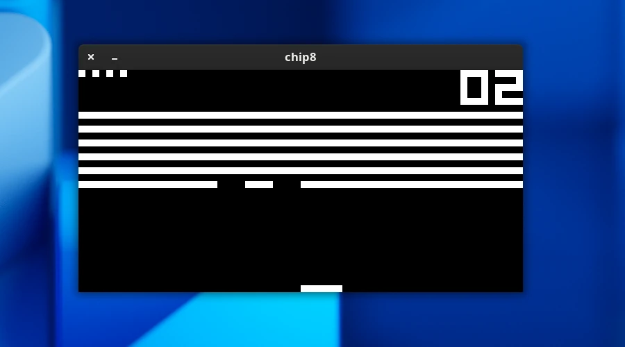

Complete CHIP-8 implementation

Building:
```
mkdir build
cd build
cmake ..
cmake --build .
```

Usage:
```
./chip8 [rom-file-name]
```

Screenshot of [Breakout (Brix hack) [David Winter, 1997]](https://github.com/kripod/chip8-roms/blob/master/games/Breakout%20(Brix%20hack)%20%5BDavid%20Winter%2C%201997%5D.ch8) running in this interpreter.


